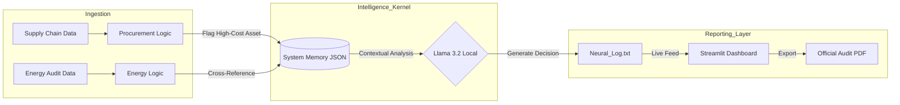

## 🏗️ Architecture


## 🚀 Getting Started

### Prerequisites
- **Python 3.11+**
- **Ollama** (for local LLM inference)
- **Streamlit** (for the UI)

### Installation
1. Clone the repository:
   ```bash
   git clone [https://github.com/preethamgowda-code/AIOS-Autonomous-Kernel.git](https://github.com/preethamgowda-code/AIOS-Autonomous-Kernel.git)
   cd AIOS-Autonomous-Kernel

### Install dependencies:
pip install streamlit fpdf ollama

### Pull the brain:
ollama pull llama3.2:latest
### Running the Kernel
Start the autonomous watcher:
python core/watcher.py
Launch the executive dashboard:
streamlit run interface/dashboard.py
